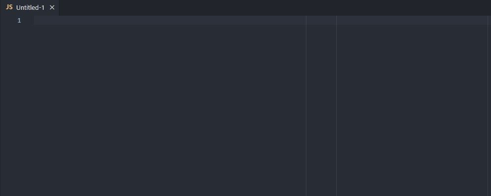

# JavaScript Snippets for Visual Studio Code

Collection of JavaScript snippets for your productivity.

## Declarations

<!-- SNIPPETS_START -->
- `.add` → `.add($1)`
- `.add` → `.addEventListener($1, )`
- `.app` → `.apply($1)`
- `.at` → `.at($1)`
- `.bin` → `.bind($1)`
- `.cal` → `.call($1)`
- `.cla` → `.classList`
- `.co` → `.concat($1)`
- `.co` → `.copyWithin($1)`
- `.con` → `.contains($1)`
- `.cre` → `.createElement($1)`
- `.dis` → `.dispatchEvent($1)`
- `.en` → `.entries($1)`
- `.ent` → `.entries($1)`
- `.ev` → `.every($1)`
- `.fi` → `.fill($1)`
- `.fi` → `.filter($1)`
- `.fi` → `.find($1)`
- `.fndx` → `.findIndex($1 => $1)`
- `.fr` → `.from($1)`
- `.frch` → `.forEach($1)`
- `.fre` → `.fromEntries($1)`
- `.get` → `.getAttribute($1)`
- `.get` → `.getElementById($1)`
- `.get` → `.getElementsByClassName($1)`
- `.get` → `.getElementsByTagName($1)`
- `.has` → `.hasAttribute($1)`
- `.in` → `.includes($1)`
- `.ino` → `.indexOf($1)`
- `.is` → `.isArray($1)`
- `.ise` → `.isExtensible($1)`
- `.isf` → `.isFrozen($1)`
- `.iss` → `.isSealed($1)`
- `.isv` → `.is($1, )`
- `.jo` → `.join($1)`
- `.ke` → `.keys($1)`
- `.la` → `.lastIndexOf($1)`
- `.ma` → `.map($1)`
- `.of` → `.of($1)`
- `.po` → `.pop()`
- `.pro` → `.prototype`
- `.pu` → `.push($1)`
- `.que` → `.querySelector($1)`
- `.que` → `.querySelectorAll($1)`
- `.re` → `.reduce($1)`
- `.re` → `.reduceRight($1)`
- `.re` → `.reverse()`
- `.rem` → `.remove($1)`
- `.rem` → `.removeAttribute($1)`
- `.rem` → `.removeEventListener($1, )`
- `.rep` → `.replace($1, )`
- `.set` → `.setAttribute($1, )`
- `.sh` → `.shift()`
- `.sl` → `.slice()`
- `.so` → `.some($1)`
- `.so` → `.sort($1)`
- `.sorf` → `(a, b) => { if ($1) { return -1 } if () { return 1 } return 0 }`
- `.sorm` → `(a, b) => a - b`
- `.spl` → `.splice($1)`
- `.tog` → `.toggle($1)`
- `.tols` → `.toLocaleString($1)`
- `.tor` → `.toReversed()`
- `.tos` → `.toSorted($1)`
- `.tos` → `.toString($1)`
- `.tosp` → `.toSpliced($1)`
- `.uns` → `.unshift($1)`
- `.val` → `.values($1)`
- `.wi` → `.with($1, )`
- `af` → `Array.from($1)`
- `ai` → `Array.isArray($1)`
- `ao` → `Array.of($1)`
- `ar` → `Array`
- `asu` → `$1.reduce((acc, cur) => acc + cur, 0)`
- `blu` → `blur`
- `cas` → `console.assert($1, '$2')`
- `ccl` → `console.clear()`
- `cco` → `console.count($1)`
- `ccr` → `console.countReset($1)`
- `cd` → `console.dir($1)`
- `cde` → `console.debug($1)`
- `cer` → `console.error($1)`
- `cgc` → `console.groupCollapsed($1)`
- `cge` → `console.groupEnd()`
- `cgr` → `console.group($1)`
- `cha` → `change`
- `ci` → `console.info($1)`
- `cla` → `class $1 { constructor(props) {} }`
- `clg` → `console.log($1)`
- `cli` → `click`
- `clj` → `console.log(JSON.stringify($1, null, 2))`
- `clo` → `const $2 = { ...$1 }`
- `cta` → `console.table($1)`
- `cte` → `console.timeEnd($1)`
- `cti` → `console.time($1)`
- `ctl` → `console.timeLog($1)`
- `ctr` → `console.trace($1)`
- `cwn` → `console.warn($1)`
- `dcl` → `const $2 = JSON.parse(JSON.stringify($1))`
- `deb` → `debugger`
- `debfn` → `function debounce(fn, delay) { let timeoutId; return function(...args) { clearTimeout(timeoutId); timeoutId = setTimeout(() => fn.apply(this, args), delay); }; }`
- `def` → `default`
- `do` → `do { $1 } while ()`
- `doc` → `document`
- `exp` → `export`
- `fnar` → `($1) => { }`
- `fnarm` → `($1) => $1`
- `foc` → `focus`
- `foc` → `focusout`
- `for` → `const $1Len = $1.length for (let i = 0; i < $1Len; i += 1) { const $1Item = $1[i] }`
- `foraw` → `for await (let item of $1) { }`
- `forin` → `for (const key in $1) { }`
- `form` → `for (let j = 0; j < $1Len; j += 1) { const $1Item = $1[j] }`
- `forof` → `for (const item of $1) { }`
- `forr` → `for (let r = $1Len - 1; r >= 0; r -= 1) { const $1Item = $1[r] }`
- `fu` → `function() { $1 }`
- `fun` → `function $1() { }`
- `iea` → `Array.isArray($1) && $1.length === 0`
- `ieo` → `Object.keys($1).length === 0`
- `iife` → `(function() { $1 })()`
- `imp` → `import from $1`
- `inp` → `input`
- `jsonpar` → `JSON.parse($1)`
- `jsonstr` → `JSON.stringify($1)`
- `key` → `keydown`
- `mou` → `mouseout`
- `mou` → `mouseover`
- `objent` → `Object.entries($1)`
- `objfre` → `Object.fromEntries($1)`
- `objfrz` → `Object.freeze($1)`
- `objise` → `Object.isExtensible($1)`
- `objisf` → `Object.isFrozen($1)`
- `objiss` → `Object.isSealed($1)`
- `objisv` → `Object.is($1, )`
<!-- SNIPPETS_END -->

## Snippet Mnemonic (Prefix) Generation Rules

To ensure all snippet prefixes are unique, memorable, and consistent, follow these rules:

### 1. Dot-methods (e.g., `.methodName`)
- Prefix: `.` + first two letters of the first word + first letter of each subsequent camelCase/PascalCase word.
- **Examples:**
  - `.toLocaleString($1)` → `.tols`
  - `.findIndex($1)` → `.fii`
  - `.fromCharCode($1)` → `.frcc`
  - `.isFrozen($1)` → `.isf`
  - `.isSealed($1)` → `.iss`

### 2. Static/Global Methods (e.g., `Object.method`, `Array.method`, `JSON.method`)
- Prefix: first three letters of the object/class (lowercase) + first three unique letters of the method name (lowercase).
- If the method name is short or ambiguous, add a distinguishing letter from the next word or argument type.
- **Examples:**
  - `Object.freeze($1)` → `objfrz`
  - `Object.is($1, )` → `objisv` (for "is value", to distinguish from `isExtensible`, `isFrozen`, etc.)
  - `Object.isExtensible($1)` → `objise`
  - `Object.isFrozen($1)` → `objisf`
  - `Object.isSealed($1)` → `objiss`
  - `JSON.parse($1)` → `jsonpar`
  - `JSON.stringify($1)` → `jsonstr`
  - `Promise.resolve($1)` → `prmres`

### 3. Keywords or Language Constructs
- Prefix: first three letters of the keyword.
- **Examples:**
  - `function` → `fun`
  - `class` → `cla`
  - `switch` → `swi`

### 4. Utilities and Patterns
- Prefix: first letter of each word in the description or a well-known abbreviation.
- **Examples:**
  - "remove duplicates array" → `rda`
  - "deep clone object" → `dcl`
  - "random integer" → `ran`
  - "short arrow function" → `saf`

### 5. If a collision occurs
- Add more letters from the method or object name until the prefix is unique.

---

**These rules guarantee that all snippet prefixes are unique, easy to type, and easy to remember.**
